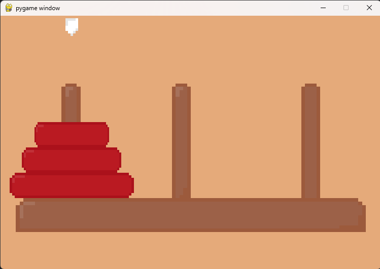

# Python pyGame Hanoi



## How to download and run

- First download [the source code from github](https://github.com/klapekm/wieza_hanoi.git)
- Once you download the file just unpack it and run
```python wieza_hanoi.py```

## Controls

- Use the spacebar to lift a disc
- Press space again to put a disc down
- Use the arrow keys to move from pole to pole
